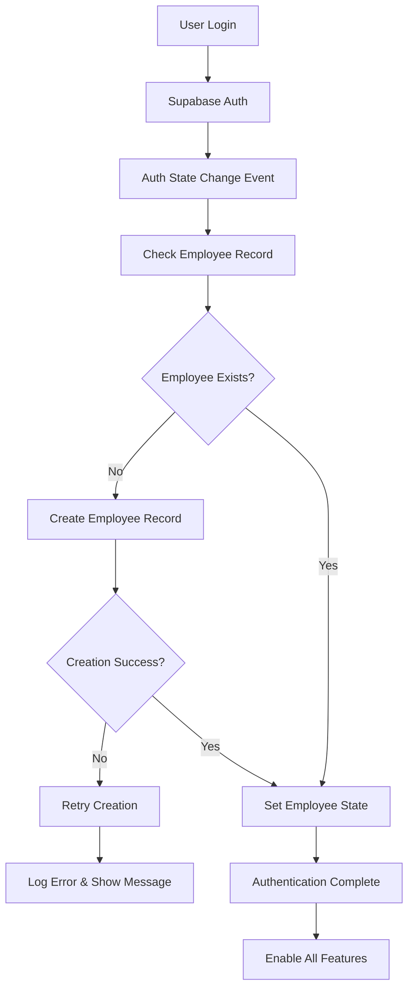
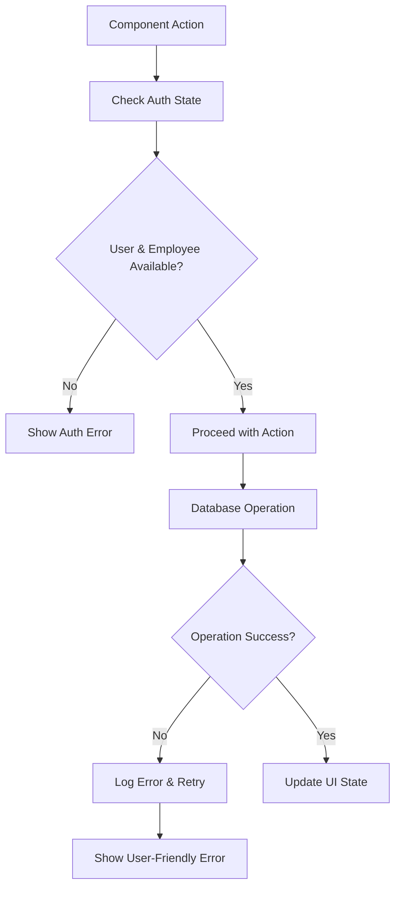

# Design Document

## Overview

This design addresses critical authentication and employee record management issues that are causing failures in task creation, history tracking, and contractor assignments. The solution focuses on creating a robust authentication flow with automatic employee record management, consistent error handling, and comprehensive debugging capabilities.

## Architecture

### Authentication Flow Architecture



### Data Access Pattern



## Components and Interfaces

### Enhanced Authentication Hook

**File:** `src/hooks/auth/useAuth.tsx`

**Key Changes:**
- Implement retry logic for employee record creation
- Add comprehensive error handling and logging
- Ensure immediate availability of employee records
- Provide debugging information in development mode

**Interface:**
```typescript
interface AuthContextType {
  user: User | null;
  session: Session | null;
  employee: Employee | null;
  loading: boolean;
  authError: string | null;
  retryEmployeeCreation: () => Promise<void>;
  signIn: (email: string, password: string) => Promise<{ error: any }>;
  signUp: (email: string, password: string, fullName?: string) => Promise<{ error: any }>;
  signOut: () => Promise<void>;
}
```

### Contractor Data Hook Improvements

**File:** `src/hooks/contractors/useContractorData.ts`

**Key Changes:**
- Add proper authentication checks before all operations
- Implement consistent error handling patterns
- Add retry mechanisms for failed operations
- Provide detailed error messages for debugging

### Task Management Enhancement

**Files:** 
- `src/components/contractors/ContractorTasks.tsx`
- `src/hooks/contractors/useContractorData.ts`

**Key Changes:**
- Validate authentication state before task operations
- Use consistent user ID retrieval patterns
- Add proper error boundaries and user feedback
- Implement automatic retry for transient failures

### History Management Enhancement

**Files:**
- `src/components/contractors/ContractorHistory.tsx`
- `src/hooks/contractors/useContractorData.ts`

**Key Changes:**
- Ensure employee record availability before history operations
- Add comprehensive error handling with user-friendly messages
- Implement consistent created_by field population
- Add debugging information for troubleshooting

### Dashboard Contractor Assignment Fix

**File:** `src/pages/Dashboard.tsx`

**Key Changes:**
- Fix employee ID matching in contractor assignment queries
- Add comprehensive debugging tools
- Implement proper error handling for assignment operations
- Provide clear feedback when no contractors are assigned

## Data Models

### Enhanced Employee Record Management

```typescript
interface EmployeeCreationData {
  user_id: string;
  email: string;
  full_name: string;
  role?: string;
}

interface AuthState {
  user: User | null;
  employee: Employee | null;
  loading: boolean;
  error: string | null;
  retryCount: number;
}
```

### Consistent Error Handling

```typescript
interface AuthError {
  type: 'EMPLOYEE_CREATION_FAILED' | 'USER_NOT_AUTHENTICATED' | 'DATABASE_ACCESS_DENIED';
  message: string;
  details?: any;
  retryable: boolean;
}

interface OperationResult<T> {
  success: boolean;
  data?: T;
  error?: AuthError;
}
```

## Error Handling

### Authentication Error Categories

1. **Employee Record Missing**
   - Automatic retry with exponential backoff
   - User notification with retry option
   - Fallback to manual employee creation

2. **Database Access Denied**
   - Check and fix RLS policies
   - Provide clear error messages
   - Log detailed information for debugging

3. **Session State Inconsistency**
   - Automatic session refresh
   - Clear error messages
   - Option to re-authenticate

### Error Recovery Strategies

```typescript
const handleAuthError = async (error: AuthError) => {
  switch (error.type) {
    case 'EMPLOYEE_CREATION_FAILED':
      if (error.retryable && retryCount < 3) {
        await retryEmployeeCreation();
      } else {
        showUserError('Unable to create employee record. Please contact support.');
      }
      break;
    
    case 'USER_NOT_AUTHENTICATED':
      redirectToLogin();
      break;
    
    case 'DATABASE_ACCESS_DENIED':
      logError('RLS Policy Issue', error.details);
      showUserError('Database access denied. Please refresh and try again.');
      break;
  }
};
```

## Testing Strategy

### Authentication Flow Testing

1. **Employee Record Creation**
   - Test automatic creation on first login
   - Test retry logic for failed creation
   - Test handling of existing employee records

2. **Session Management**
   - Test session persistence across page refreshes
   - Test authentication state consistency
   - Test error handling for expired sessions

3. **Database Operations**
   - Test task creation with proper user attribution
   - Test history entry creation with authentication
   - Test contractor assignment queries

### Integration Testing

1. **End-to-End Contractor Management**
   - Create contractor → Assign to employee → View on dashboard
   - Create task → View in task list → Update status
   - Add history entry → View in contractor profile

2. **Error Scenario Testing**
   - Test behavior with missing employee records
   - Test database access failures
   - Test network connectivity issues

### Debugging and Monitoring

1. **Development Tools**
   - Console logging for authentication state changes
   - Debug buttons for manual state inspection
   - SQL scripts for database verification

2. **Production Monitoring**
   - Error tracking for authentication failures
   - Performance monitoring for database operations
   - User feedback collection for error scenarios

## Database Schema Updates

### RLS Policy Fixes

```sql
-- Ensure all contractor-related tables have proper RLS policies
-- Allow authenticated users full access to their data
-- Fix any overly restrictive policies blocking legitimate operations

-- contractor_internal_link policies
CREATE POLICY "Authenticated users can manage contractor assignments" 
  ON contractor_internal_link FOR ALL TO authenticated USING (true);

-- contractor_task policies  
CREATE POLICY "Authenticated users can manage contractor tasks"
  ON contractor_task FOR ALL TO authenticated USING (true);

-- contractor_history policies
CREATE POLICY "Authenticated users can manage contractor history"
  ON contractor_history FOR ALL TO authenticated USING (true);
```

### Employee Record Consistency

```sql
-- Ensure all employee records have proper user_id references
-- Add constraints to prevent orphaned records
-- Create indexes for performance optimization

ALTER TABLE internal_employee 
ADD CONSTRAINT fk_internal_employee_user_id 
FOREIGN KEY (user_id) REFERENCES auth.users(id) ON DELETE CASCADE;

CREATE INDEX idx_internal_employee_user_id ON internal_employee(user_id);
```

## Implementation Priority

1. **Critical Path (P0)**
   - Fix authentication hook with retry logic
   - Update RLS policies for database access
   - Fix task and history creation functions

2. **High Priority (P1)**
   - Enhance error handling and user feedback
   - Fix dashboard contractor assignment display
   - Add comprehensive debugging tools

3. **Medium Priority (P2)**
   - Implement performance optimizations
   - Add monitoring and analytics
   - Create comprehensive test suite

## Security Considerations

1. **Data Access Control**
   - Ensure RLS policies properly restrict data access
   - Validate user permissions before all operations
   - Log security-related events for auditing

2. **Authentication Security**
   - Use secure session management
   - Implement proper token validation
   - Handle authentication edge cases securely

3. **Error Information Disclosure**
   - Avoid exposing sensitive information in error messages
   - Log detailed errors server-side only
   - Provide user-friendly error messages without technical details